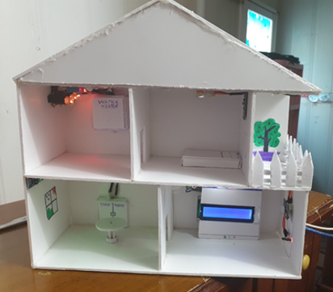
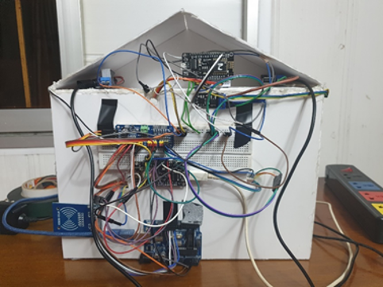

# smart-home
This is my final project in the IoT class at Hanoi University of Science and Technology. I worked on many sensor, actuator, processor module and then integrated them to a complete system. I used 02 ESP8266, 01 Arduino and Blynk for most applications and it worked perfectly.

Functions:
- Intelligent secured door: RFID lock with facial recognition security AI camera and GPS
- Automatic lights: LEDs 3W and light sensors
- Automatic heater: light bulks and temperature sensors
- Secured environment: fire sensor, PIR motion sensor and buzzer
- Infortainment and control: LCD screen, Blynk App (control center)
- Connection: WiFi, Gateway/Router, custom TCP/IP, MQTT
- More to explore ...

Please give me a ⭐ if you find it useful.

